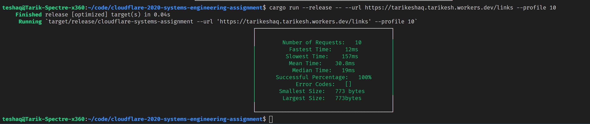
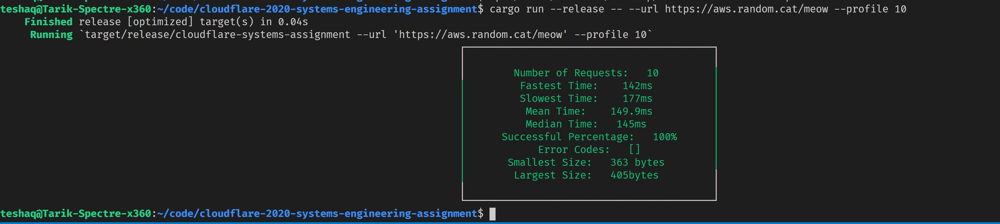

# Systems Assignment 🦀

## Prerequisites:
- Clone the repo ⬇️ using `git clone https://github.com/tarikeshaq/cloudflare-2020-systems-engineering-assignment` 
- You would need Rust installed, best way to do that is the `rustup` route: https://rustup.rs/
- That's it!

## How to run:
Convieniently this crate is published on crates.io so you could pull it from there, however, if you want to run it locally
simply run:

```
cargo run -- --url <URL> --profile <NUMBER>
```

(Note, you can also add the `--release` flag to run an optimized version of the crate)

And it would run `NUMBER` of HTTP get requests against `URL`, and present you with results.

### See the response
In addition to the profiling data, if you'd like to see the response of a request, simply omit the `--profile`.
I chose not to show the responses when we profile as that would just clutter the stdout.

i.e, if you run `cargo run -- --url https://tarikeshaq.tarikesh.workers.dev/links` it will print out the response

## Example outputs:
- When running `cargo run --release -- --url https://tarikeshaq.tarikesh.workers.dev/links --profile 10`:

- When running `cargo run --release -- --url https://aws.random.cat/meow --profile 10`


It seems that the cloudflare website is pretty darn fast 🥳

## License
This is a project solving an optional assignment from cloudflare and thus is licensed using the same license. Check it out in [`LICENSE`](./LICENSE)